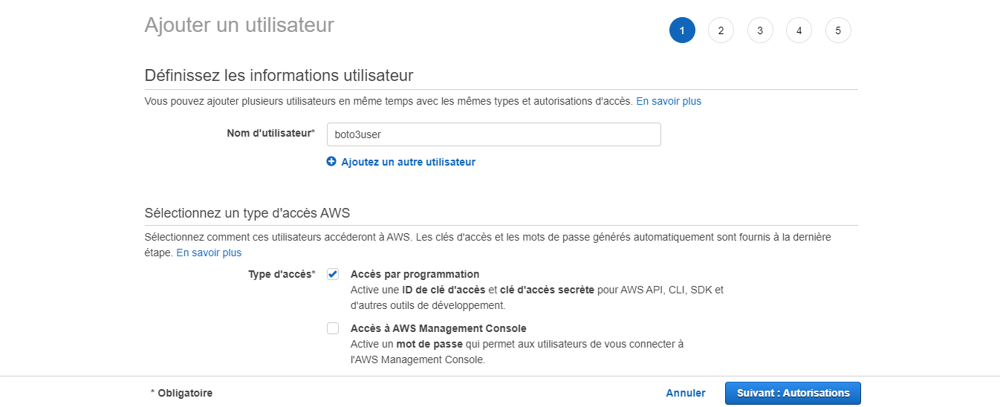
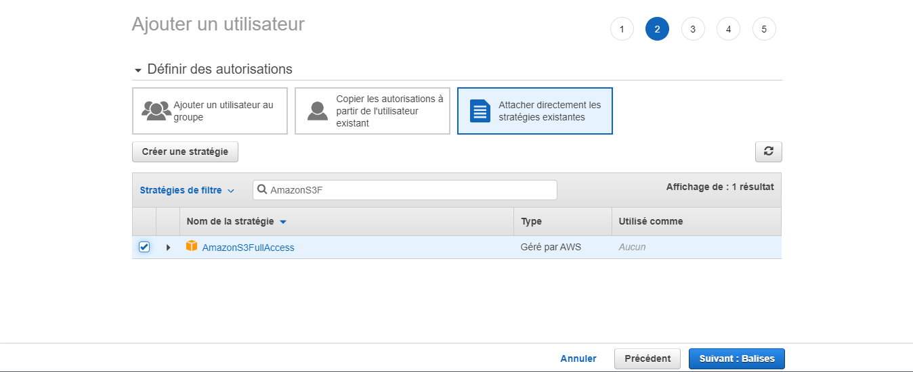
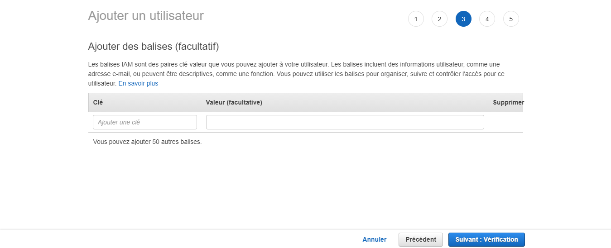
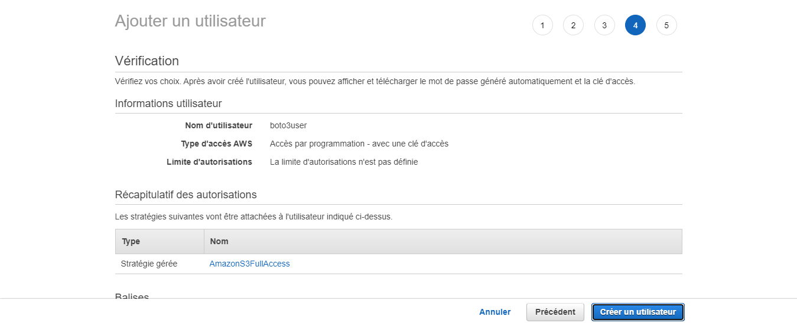

# data_engineer_project
A simple data engineer project to implement some skills

## Project's purpose
I do this project to implement and show some of my data engineer skills. It could also be a fruitful support in order to discuss in an interview.

For this project I will only use cloud services, especially AWS ones.

For the context, let's imagine that we are in a company which wants to understand what makes football fixtures attractive.

To do this, we will create our datalake, where we will store and process all of our data.

To avoid costs and because my purpose is focused on the engineering part, the analysis part will be very restricted.
It will consist in observing the correlation between some basic stats (goals, shots, etc) and the attractiveness of a match based on a sentimental analysis of tweets.
I will focus on english Barclays Premier League, considering all the teams and matchweeks for the current season (2020/2021).

## AWS account

To begin, we have to create an AWS account at this link :
https://portal.aws.amazon.com/billing/signup#/start

Pay attention to the pricing conditions. The AWS Free Tier conditions are provided here :
https://aws.amazon.com/free/?nc1=h_ls&all-free-tier.sort-by=item.additionalFields.SortRank&all-free-tier.sort-order=asc

We can opt in to or out of the AWS Free Tier usage alerts through the Billing and Cost Management console.
Sign in to the AWS Management Console and open the Billing and Cost Management console at
https://console.aws.amazon.com/billing/.
Under Preferences in the navigation pane, choose Billing preferences.
Under Cost Management Preferences, select Receive AWS Free Tier Usage Alerts to opt in to Free Tier usage alerts. To opt out, clear the Receive AWS Free Tier Usage Alerts check box.


## Installation

This part is written using https://realpython.com/python-boto3-aws-s3/ and AWS ressources.

Install the Boto3 SDK on your computer with the following command:
```shell
$ pip install boto3
```

To make it run against your AWS account, you’ll need to provide some valid credentials. If you already have an IAM user that has full permissions to S3, you can use those user’s credentials (their access key and their secret access key) without needing to create a new user. Otherwise, the easiest way to do this is to create a new AWS user and then store the new credentials.

To create a new user, go to your AWS account, then go to Services and select IAM. Then choose Users and click on Add user.

Give the user a name (for example, boto3user). Enable programmatic access. This will ensure that this user will be able to work with any AWS supported SDK or make separate API calls.



To keep things simple, choose the preconfigured AmazonS3FullAccess policy. With this policy, the new user will be able to have full control over S3.



Skip this third screen:



Click on Create User (Créer un utilisateur).



A new screen will show you the user’s generated credentials. Click on the Download .csv button to make a copy of the credentials. You will need them to complete your setup.

Install the AWS CLI version 2 if you haven't installed yet. Because I'm working on Windows, I can install it on https://docs.aws.amazon.com/cli/latest/userguide/install-cliv2-windows.html.

Now that you have your new user and enable the AWS CLI version 2, run the following command to complete your setup:
```shell
$ aws configure
```
Fill in the requested information with the corresponding values from your csv file.
For the Default region name, select your region with https://docs.aws.amazon.com/fr_fr/general/latest/gr/rande.html#s3_region. In my case, I am using eu-west-3 (Paris).
For the default output format, select json. You can see the different formats at https://docs.aws.amazon.com/fr_fr/cli/latest/userguide/cli-configure-quickstart.html#cli-configure-quickstart-config.

## Data

To handle the three existing data type, I will use:
- Structured data: a csv file containing the team code (abbreviation) of each club
- Semi-structured data: json data from API-Football
- Unstructured data: tweets from the Twitter API

To handle the two existing ingestion modes, data will be ingest by:
- Batch processing: data from API-Football
- Real-time processing (streaming): tweets from Twitter API

### CSV file

To get some tweets about our fixtures, we need the team code of each team.
For that, I made a csv file using team codes provided on https://liaison.reuters.com/tools/sports-team-codes.

Link of the csv file

### APIs

Twitter API
Tweets I want to get

API-Football
Stats I want to get

### Data ingestion
All the data are first stored in their raw format into an S3 bucket which I will call "".

### Which services ?
Glue
Kinesis
Lambda

### Which triggers ?

## Designing data lake
