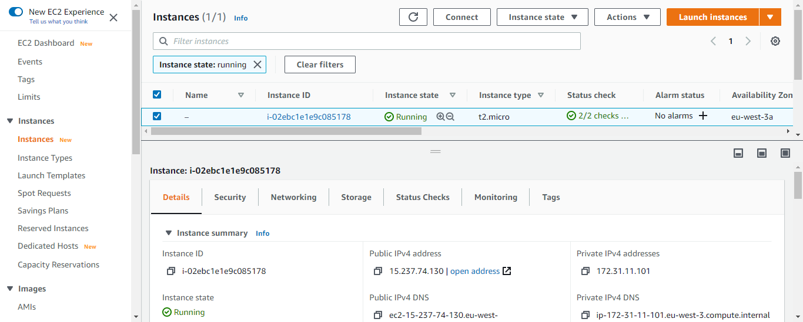
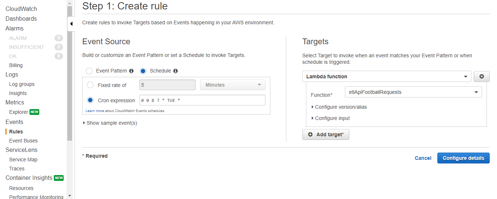

# data_engineer_project (in progress)
A simple data engineer project to implement some skills

## Project's purpose
I do this project to implement some of my data engineer skills. It could also be a fruitful support in order to discuss in an interview.

For this project I will only use cloud services, especially AWS ones.

For the context, let's imagine that we are in a company which wants to analyze the difference between expected goals and points, and real goals and points for each football team in a same league.

For this project I will create a data lake, where I will store and process data before loading them weekly into a database.
Because my purpose is focused on the engineering part, the analysis part will be very restricted.

I will focus on english Barclays Premier League, considering all the teams and matchweeks for the current season (2020/2021).

## Prerequisites

If you want to run this project by yourself, these are the prerequisites:

- Python 3: https://www.python.org/downloads/

- Pandas library: https://pandas.pydata.org/pandas-docs/stable/getting_started/install.html

- Requests library:
```shell
$ pip install requests
```

- An AWS account: https://portal.aws.amazon.com/billing/signup#/start

- AWS CLI version 2: https://docs.aws.amazon.com/cli/latest/userguide/install-cliv2.html

- Boto3 SDK:
```shell
$ pip install boto3
```

- A RapidAPI account and key: https://rapidapi.com/marketplace

## AWS Free Tier usage alerts

Pay attention to the pricing conditions. The AWS Free Tier conditions are provided here :
https://aws.amazon.com/free/?nc1=h_ls&all-free-tier.sort-by=item.additionalFields.SortRank&all-free-tier.sort-order=asc

To minimize cost, I recommend you to clean up resources as soon as you finish this project.

To opt in to the AWS Free Tier usage alerts, sign in to the AWS Management Console and open the Billing and Cost Management console at https://console.aws.amazon.com/billing/.
Under Preferences in the navigation pane, choose Billing preferences.
Under Cost Management Preferences, select Receive AWS Free Tier Usage Alerts to opt in to Free Tier usage alerts. To opt out, clear the Receive AWS Free Tier Usage Alerts check box.

## Data lake deployment


To create S3 bucket and upload files into it with running my python scripts locally, I use the boto3 SDK.

### Creation of a new AWS IAM user

To make boto3 run against my AWS account, I’ll need to provide some valid credentials. If you already have an IAM user that has full permissions to S3, you can use those user’s credentials (their access key and their secret access key) without needing to create a new user. Otherwise, we have to create a new AWS user and then store the new credentials.

To create a new user, I have to use AWS Identity and Access Management (IAM).

I give the user a name (for example, boto3user), and enable programmatic access to ensure that this user will be able to work with any AWS supported SDK or make separate API calls.

To keep things simple, I choose the preconfigured AmazonS3FullAccess policy. With this policy, the new user will be able to have full control over S3.

At the last user creation step, a new screen shows the user’s generated credentials. I click on the Download .csv button to make a copy of the credentials.

Now that I have my new user, I run the following command to complete my setup:
```shell
$ aws configure
```
I fill in the requested information with the corresponding values from my csv file.
For the Default region name, I select my region using https://docs.aws.amazon.com/fr_fr/general/latest/gr/rande.html#s3_region. In my case, I am using eu-west-3 (Paris).
For the default output format, I select json. The different formats are provided at https://docs.aws.amazon.com/fr_fr/cli/latest/userguide/cli-configure-quickstart.html#cli-configure-quickstart-config.

### Data lake structure


I get football data using API-Football. Here is its documentation: https://www.api-football.com/documentation-v3.

After creating my RapidAPI account and getting my API key (https://rapidapi.com/marketplace), I get the english Barclays Premier League id by sending a request to the API. The id is 39. Now I can write my python script datalakeDeployment.py to get data from API-Football and deploy my data lake by running the script locally.

This script create my data lake as an S3 bucket named with a globally unique name to satisfy S3 policy requirements.
Then it uploads teamcodes.csv to the data lake, into a folder named "processed-data". I made this csv file myself by aggregating the API-Football id, the name, and the team code (for example 'ARS' for Arsenal) of each team. It could be useful to go further in this project by getting some tweets for sentimental analysis.
After that, the script requests API-Football to get previous fixtures, their statistics, and the next week fixtures. Data are uploaded in their json raw format as json files to the data lake into the folders "raw-data/api-football/previous-fixtures", "raw-data/api-football/statistics", and "raw-data/api-football/next-fixtures". Finally, the json data are processed to be uploaded as csv files to the data lake into the folders "processed-data/api-football/previous-fixtures", "processed-data/api-football/statistics", and "processed-data/api-football/next-fixtures". As for teamcodes.csv, I want to get the next week fixtures to be able to go further in this project by handle tweets streaming for some fixtures.

If you want to run the script by yourself, make sure that you filled your API key in place of 'XXX'. Also, pay attention to the API-Football pricing (free until 100 requests per day, around €0.00450 / request beyond). Since the script will send one request to get the previous fixtures, another one to get the next week fixtures, then another one to each of the previous fixtures to get their statistics, you will begin to pay around €0.00450 / fixture for each fixture after the 98 firsts.

## ETL with AWS Lambda

With AWS, there are several ways to perform ETL jobs. You can for example use AWS Glue, which is a serverless data integration service, but also AWS Lambda, which is a serverless compute service. For this project I will use them both. I will use AWS Lambda for the first ETL job that I will create.

As I did to deploy the data lake, I want to extract data from API-Football and upload them to the data lake. I want to extract data about the previous week fixtures, their statistics, and the next week fixtures.

To do that, I create a new python Lambda function that I name etlApiFootballRequests. I wrote the python script for this Lambda function in etlApiFootballRequests.py. I just have to copy paste the whole script into my new Lambda function.

Because I use the requests package in my script, I first have to install it as a layer for my Lambda function. A Lambda function layer can include several packages. Because I will create another Lambda function which will use pandas, and while it's more relevant to just install the needed packages for a Lambda function, I will create a layer including the requests and the pandas packages, as this is just a small project to implement some skills, and for which I think it's not very relevant to do the same operation several times.

### Lambda layer creation

I create my Lambda layer by uploading first the packages needed (in my case requests and pandas) as a zip file to an S3 bucket (I will use the data lake that I have created).

I could download the packages locally, but for this project, it can be relevant to do it using an EC2 instance. EC2 is a web service that provides secure and resizable compute capacity in the cloud. I did this part using https://towardsdatascience.com/automating-etl-with-aws-Lambda-97b9e3404929. After uploading packages as a zip file to S3, I will attach it as a layer to Lambda. function. This is an illustration of the workflow:


To create my EC2 instance, I choose the operating system "Ubuntu Server 18.04 LTS (HVM)", and the instance "t2.micro" which is include in the AWS free tier.

I create a new IAM role for this EC2 instance with the “AmazonS3FullAccess” policy.

Just before launching the instance, I create a new key pair, named it "mykeypair", and download the key pair. Then I launch my EC2 instance.



To connect me to the instance, I copy the example code, paste it into my command prompt changing the path of the key (in my case "mykeypair.pem"), and run the command.

Then, I run these commands:
```shell
sudo apt-get update   # Update the system
python -V  # Check the version of python
sudo apt-get install python3.7 -y    # Installing python version 3.7

# Updating alternatives - This points to python 3.7 insted of 3.6 when we open python (Updates the Symbolic links)
sudo update-alternatives --install /urs/bin/python3 python3 /usr/python3.6 1
sudo update-alternatives --install /urs/bin/python3 python3 /usr/python3.7 2

# Create a directory to install all the packages we need
mkdir -p build/python/lab/python3.7/site-packages

# Install Pip , Zip and aws CLI
sudo apt install python3-pip # Hit "Y" if you get a prompt "Do you want to continue? [Y/n]"
sudo apt-get install awscli
sudo apt-get install zip

# Install required packages
pip3 install pandas requests -t build/python/lab/python3.7/site-packages/ --system

cd build/

# Zip the installed packages to be uploaded to S3
zip -r pandas_requests.zip .

# Copy the Zip file to my S3 bucket, into the raw-data folders
# (I had created a S3 bucket called datalake-57e3d8aa-01ab-432f-8b25-78d63bb86886)
aws s3 cp pandas_requests.zip s3://datalake-57e3d8aa-01ab-432f-8b25-78d63bb86886/raw-data/
```
Now that my packaged zip file is uploaded to my S3 bucket, I go to my S3 bucket into my raw-data folder to copy the object URL of the zip file, then I paste the URL into the layer configuration while creating the layer.

Finally, I return to my Lambda function and now I can add the layer.

### Schedule the Lambda function

I schedule my etlApiFootballRequests Lambda function using CloudWatch, with a cron expression.
I schedule this ETL job each Tuesday at 8 AM, with the cron expression 0 0 8 ? * TUE *.


