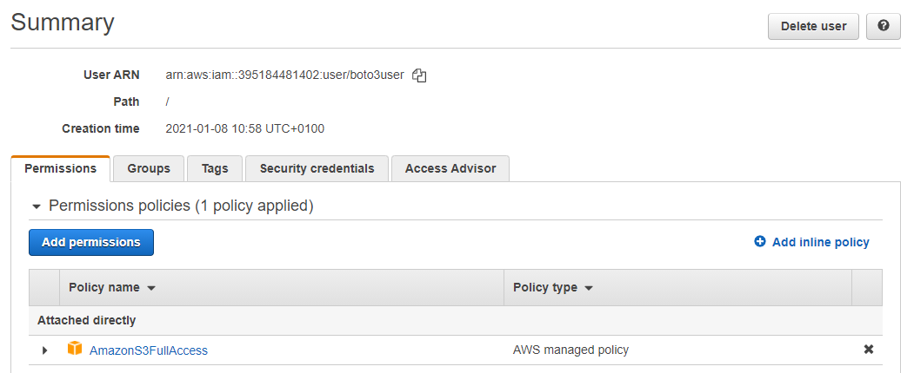
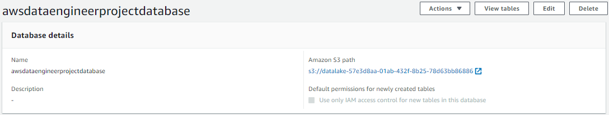
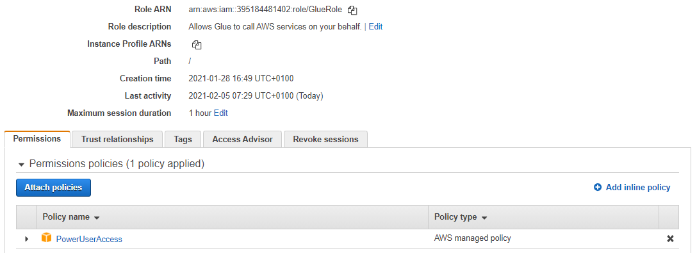
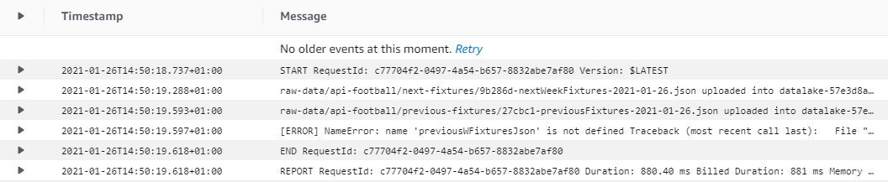

# AWS Data Engineer (in progress)
A simple data engineer project to implement some skills

## 1 Project's purpose
I do this project to implement some of my data engineer skills. It could also be a fruitful support in order to discuss in an interview.

For this project I will only use cloud services, especially AWS ones.

For the context, let's imagine that we are in a company which wants to analyze the difference between expected goals and points, and real goals and points for each football team in a same league.

For this project I will create a data lake, where I will store and process data before loading them weekly into a database.
Because my purpose is focused on the engineering part, the analysis part will be very restricted.

I will focus on english Barclays Premier League, considering all the teams and matchweeks for the current season (2020/2021).

## 2 Prerequisites

If you want to run this project by yourself, these are the prerequisites:

- Python 3: https://www.python.org/downloads/

- Pandas library: https://pandas.pydata.org/pandas-docs/stable/getting_started/install.html

- Requests library:
```shell
$ pip install requests
```

- An AWS account: https://portal.aws.amazon.com/billing/signup#/start

- AWS CLI version 2: https://docs.aws.amazon.com/cli/latest/userguide/install-cliv2.html

- Boto3 SDK:
```shell
$ pip install boto3
```

- A RapidAPI account and key: https://rapidapi.com/marketplace

- A subscription to the "Basic" plan for API-Football: https://rapidapi.com/api-sports/api/api-football/pricing

- A subscription to the "Basic" plan for API-Football-Beta: https://rapidapi.com/api-sports/api/api-football-beta/pricing

## 3 AWS Free Tier usage alerts

Pay attention to the pricing conditions. The AWS Free Tier conditions are provided here :
https://aws.amazon.com/free/?nc1=h_ls&all-free-tier.sort-by=item.additionalFields.SortRank&all-free-tier.sort-order=asc

To minimize cost, I recommend you to clean up resources as soon as you finish this project.

To opt in to the AWS Free Tier usage alerts, sign in to the AWS Management Console and open the Billing and Cost Management console at https://console.aws.amazon.com/billing/.
Under Preferences in the navigation pane, choose Billing preferences.
Under Cost Management Preferences, select Receive AWS Free Tier Usage Alerts to opt in to Free Tier usage alerts. To opt out, clear the Receive AWS Free Tier Usage Alerts check box.

## 4 Data lake deployment


To create S3 bucket and upload files into it with running my python scripts locally, I use the boto3 SDK.

### 4.1 Creation of a new AWS IAM user

To make boto3 run against my AWS account, I’ll need to provide some valid credentials. If you already have an IAM user that has full permissions to S3, you can use those user’s credentials (their access key and their secret access key) without needing to create a new user. Otherwise, we have to create a new AWS user and then store the new credentials.

To create a new user, I have to use AWS Identity and Access Management (IAM).

I give the user a name (in my case, boto3user), and enable programmatic access to ensure that this user will be able to work with any AWS supported SDK or make separate API calls.

To keep things simple, I choose the preconfigured AmazonS3FullAccess policy. With this policy, the new user will be able to have full control over S3.

At the last user creation step, a new screen shows the user’s generated credentials. I click on the Download .csv button to make a copy of the credentials.



Now that I have my new user, I run the following command to complete my setup:
```shell
$ aws configure
```
I fill in the requested information with the corresponding values from my csv file.
For the Default region name, I select my region using https://docs.aws.amazon.com/fr_fr/general/latest/gr/rande.html#s3_region. In my case, I am using eu-west-3 (Paris).
For the default output format, I select json. The different formats are provided at https://docs.aws.amazon.com/fr_fr/cli/latest/userguide/cli-configure-quickstart.html#cli-configure-quickstart-config.

### 4.2 Data lake structure


I get football data using API-Football. Here is its documentation: https://www.api-football.com/documentation-v3.

After creating my RapidAPI account and getting my API key (https://rapidapi.com/marketplace), I get the english Barclays Premier League id by sending a request to the APIs. The Barclays Premier League id is 2790 for API-Football and 39 for API-Football-Beta. Now I can write my python script datalakeDeployment.py to get data from API-Football and deploy my data lake by running the script locally.

This script create my data lake as an S3 bucket named with a globally unique name to satisfy S3 policy requirements.
Then it uploads teamcodes.csv to the data lake, into a folder named "processed-data". I made this csv file myself by aggregating the API-Football id, the name, and the team code (for example 'ARS' for Arsenal) of each team. It could be useful to go further in this project by getting some tweets for sentimental analysis.
After that, the script requests API-Football to get previous fixtures, and their statistics. Data are uploaded in their json raw format as json files to the data lake into the folders "raw-data/api-football/fixtures", and "raw-data/api-football/statistics". Finally, the json data are processed to be uploaded as csv files to the data lake into the folders "processed-data/api-football/fixtures" and "processed-data/api-football/statistics".

If you want to run the script by yourself, make sure that you filled your API key in place of 'XXX'. Also, pay attention to the API-Football pricing (free until 100 requests per day, around €0.00450 / request beyond). Since the script will send one request to get the fixtures, then another one to each of the finished fixtures to get their statistics, you will begin to pay around €0.00450 / fixture for each fixture after the 99 firsts.

### 4.3 Data lake configuration

Using AWS Lake Formation, I specify my S3 bucket as the data lake location.


Then, I create a new database named "awsdataengineerprojectdatabase" specifying the Amazon S3 path to my bucket.



To catalog the data stored into the data lake, I create a crawler that I name "S3datalake", using AWS Glue, and that I schedule every Tuesday at 10 AM (GMT) for years 2020 and 2021 using the cron expression "0 10 ? * TUE 2020-2021". Pay attention that the time zone used by CloudWatch for cron expressions is GMT.
Just before, I create for my crawler a new IAM role that I name "GlueRole" with the AdministratorAccess policy.




Once the crawler created, I run it.
The crawler add 5 tables to awsdataengineerprojectdatabase. These tables contain the schema of my data.


## 5 ETL jobs with AWS Lambda

With AWS, there are several ways to perform ETL jobs. You can for example use AWS Glue, which is a serverless data integration service, but also AWS Lambda, which is a serverless compute service. For this project I will use them both. I will use AWS Lambda for the firsts ETL jobs I will create, to show two different ways to run a Lambda function automatically: whith a scheduler, and with a trigger from S3.

### 5.1 Lambda role

I first create a new IAM role that I name "LambdaFullAccessToS3" to give AmazonS3FullAccess and AWSLambdaBasicExecutionRole permissions to my Lambda functions.


### 5.2 Adding layers to Lambda functions

In my scripts that I want to run as Lambda functions, I use the requests and pandas packages, which are not directly available in Lambda.
In order to use any of these packages in a Lambda function, I have to add a layer to the Lambda function. For example, if I have a Lambda function using pandas, I have to add it a pandas layer to allow the pandas package import.

Whenever it is needed, I add the required layer using the Klayers repository on github:
https://github.com/keithrozario/Klayers

For my Lambda functions I have to find the right ARN (AWS Resource Name) inside the deployments folder for python3.8.
After checking the region mentioned in my Lambda function ARN, on the top-right corner of the Lambda function screen (in my case 'eu-west-3'),I select the corresponding csv file available in the repository.
Finally, I just have to copy paste the ARN of the layer that I need.

If you want more details go on https://medium.com/@melissa_89553/how-to-import-python-packages-in-aws-lambda-pandas-scipy-numpy-bb2c98c974e9.

### 5.3 etlGetFixtures job

As I did to deploy the data lake, I want to extract data from API-Football-Beta and upload them to the data lake. I want to extract data about the previous week fixtures, their statistics, and the next week fixtures.
As for teamcodes.csv, I want to get the next week fixtures to be able to go further in this project by handle tweets streaming for some fixtures.

I create a new python Lambda function that I name etlGetFixtures, giving the LambdaFullAccessToS3 IAM role.
I wrote the python script for this Lambda function in etlGetFixtures.py. I just have to copy paste the whole script into my new Lambda function specifying my data lake bucket name and my api key, and add the requests layer to my Lambda function. I also set the timeout to 10 seconds instead of 3, to prevent the case where there are a lot of previous week fixtures to request for their statistics.


#### 5.3.1 Schedule the Lambda function

I schedule my etlGetFixtures Lambda function using CloudWatch, with a cron expression.
I schedule this ETL job each Tuesday at 8 AM (GMT) for years 2020 and 2021, with the cron expression "0 8 ? * TUE 2020-2021".


### 5.4 etlJsonToCsvFixtures and etlGetStatistics jobs

Now that my first job is created and scheduled to get previous week fixtures from API-Football-Beta each Tuesday at 8 AM, I will create a new ETL job with Lambda to process each json file uploaded into the raw-data folder of my data lake, then upload the processed data as a csv file into the processed-data folder.

I also want to get statistics for every finished fixtures, upload them as json file into the raw-data folder, and process them to a csv file to upload into the processed-data folder.

As previously, I just have to create a new Lambda function for each of these jobs, giving them the LambdaFullAccessToS3 IAM role, and copy paste my python scripts etlJsonToCsvFixtures.py and etlGetStatistics.py to the corresponding Lambda function.
For etlGetStatistics, I also have to specify my api key in the script.

I set the timeout of these two Lambda functions to 10 seconds instead of 3, to prevent the case where there are a lot of previous week fixtures and statistics to process.

According to the packages they use, I add to etlJsonToCsvFixtures the pandas layer, and to etlGetStatistics the pandas and requests layers.

etlJsonToCsvFixtures layer:


etlGetStatistics layers:


#### 5.4.1 Trigger the Lambda functions with S3

To trigger my Lambda functions each time that an object is putted into my data lake, I have to create event notifications.

As shown in my following screenshots, I select the right prefix, suffix, and event type for each trigger.

etlJsonToCsvFixtures trigger:


etlGetStatistics trigger:


## 6 CloudWatch metrics and logs

On the monitoring screen of a Lambda function, there are some views of several metrics and logs, provided by CloudWatch, the monitoring and observability service on AWS.

In addition to these views, I use CloudWatch to monitor and troubleshoot all of my jobs (Lambda functions or Glue jobs).

For instance, this log group shows me that my Lambda function raised a NameError. Hence I have to troubleshoot my Lambda function (in this case I simply wrote "previousWFixturesJson" in place of "previousFixturesJson").



This other one shows me that my Lambda function raised a ClientError with an AccessDenied. In this case I forgot to give AmazonS3FullAccess permissions to my Lambda function.


Finally, this log group shows me that next week fixtures were processed to csv and uploaded to the data lake successfully.


I had to use CloudWatch to troubleshoot my jobs several times for this project.

## 7 ETL Glue Jobs

In order to run a machine learning algorithm that predicts goals for each team of a fixture, I first have to transform my data into this specific schema:


To do this I create two new folder into my data lake:
- processed-data/api-football/hometeams-fixtures-statistics/
- processed-data/api-football/awayteams-fixtures-statistics/

Then I create two ETL jobs with Glue:
- hometeamstatistics (glueJobHomeTeamStatistics.py)


- awayteamstatistics (glueJobAwayTeamStatistics.py)


Finally, I create a new trigger to schedule these jobs each Tuesday at 9 AM (GMT) for years 2020 and 2021, with the cron expression "0 9 ? * TUE 2020-2021".


