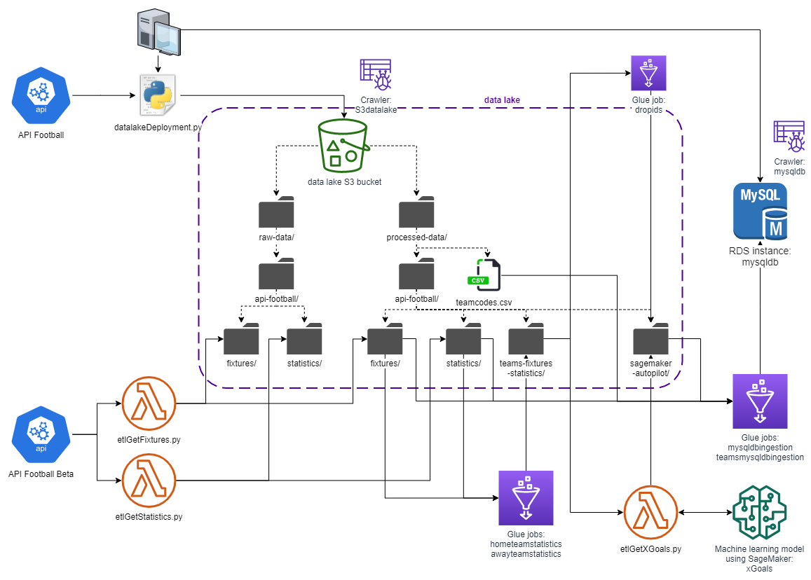
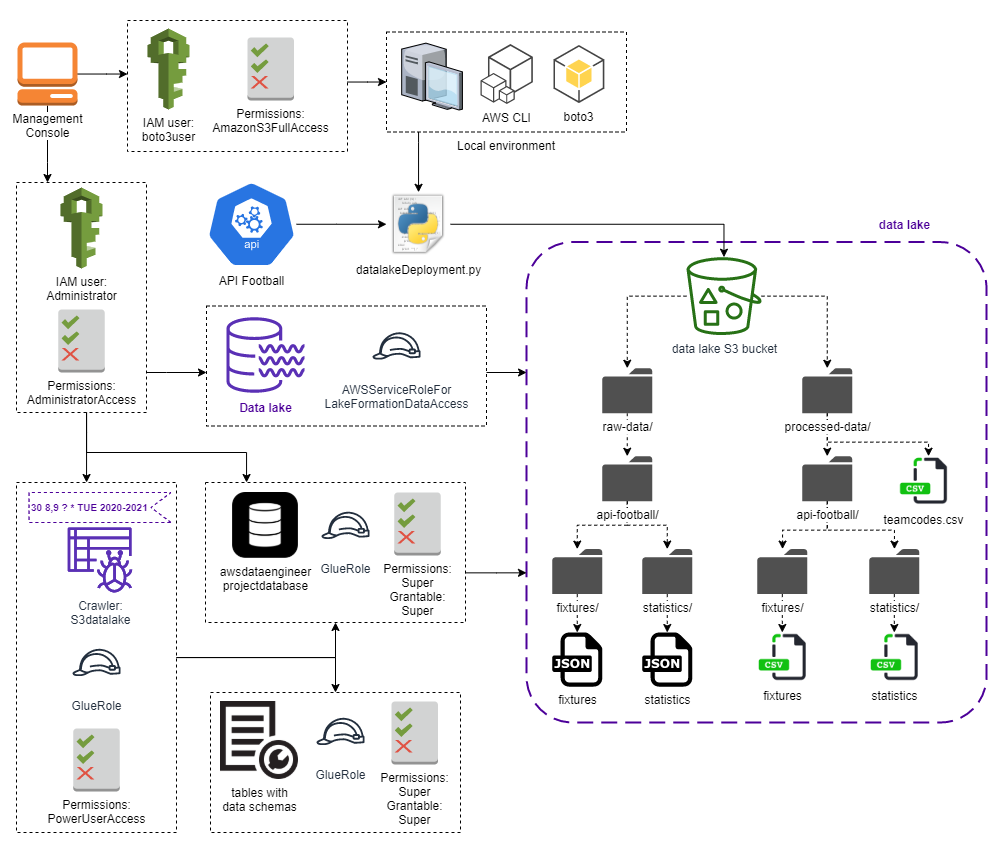
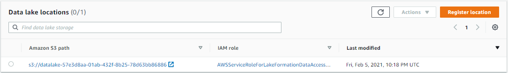
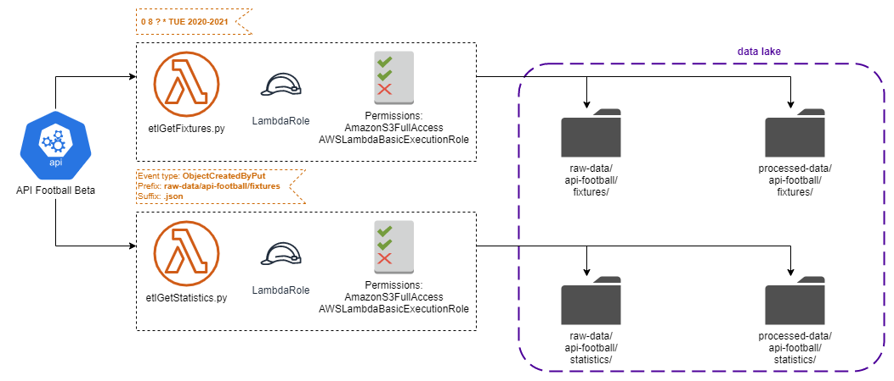
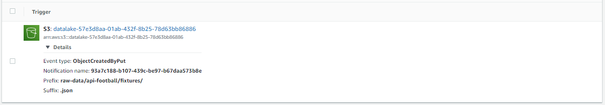
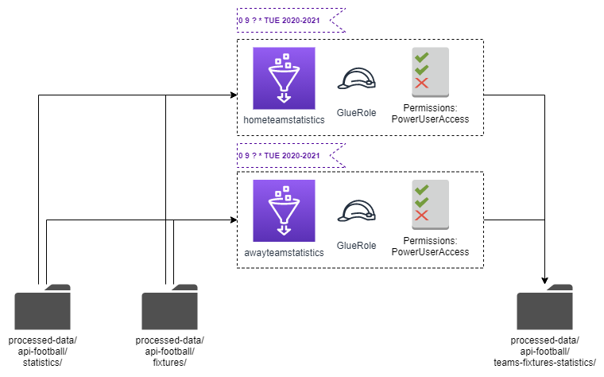
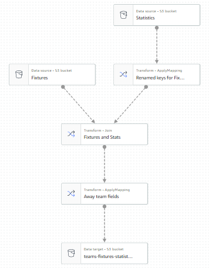
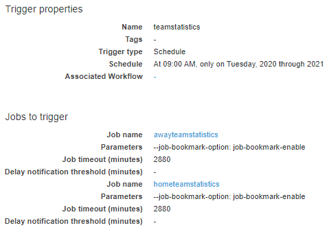
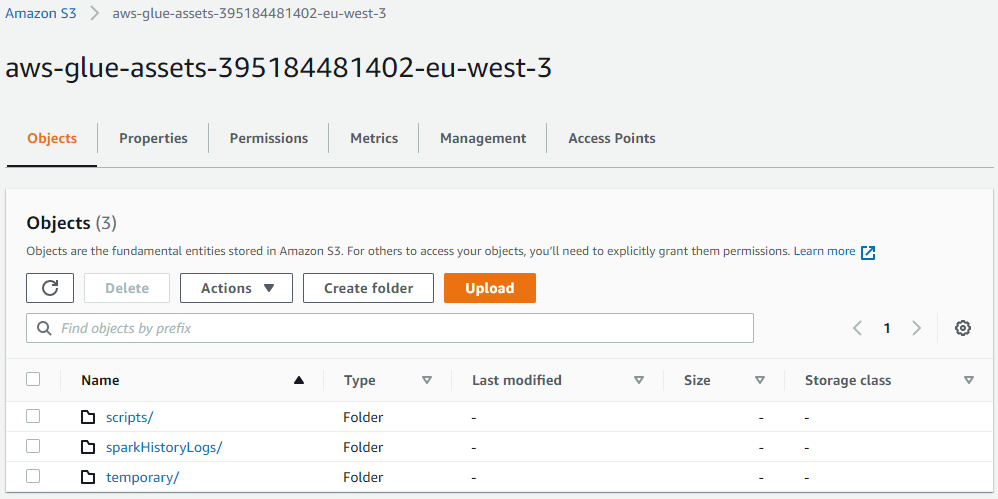

# AWS Data Engineer (in progress)

<!-- TOC -->

  - [1. Project's purpose](#1-projects-purpose)
  - [2. Prerequisites](#2-prerequisites)
  - [3. AWS Free Tier usage alerts](#3-aws-free-tier-usage-alerts)
  - [4. Data lake deployment](#4-data-lake-deployment)
    - [4.1. Creation of a new user to use boto3](#41-creation-of-a-new-user-to-use-boto3)
    - [4.2. Python script](#42-python-script)
    - [4.3. Creation of a new administrator user](#43-creation-of-a-new-administrator-user)
    - [4.4. Data lake configuration](#44-data-lake-configuration)
  - [5. ETL jobs with AWS Lambda](#5-etl-jobs-with-aws-lambda)
    - [5.1. Lambda role](#51-lambda-role)
    - [5.2. Adding layers to Lambda functions](#52-adding-layers-to-lambda-functions)
    - [5.3. etlGetFixtures job](#53-etlgetfixtures-job)
      - [5.3.1. Schedule the Lambda function](#531-schedule-the-lambda-function)
    - [5.4. etlGetStatistics job](#54-etlgetstatistics-job)
      - [5.4.1. Trigger the Lambda function with S3](#541-trigger-the-lambda-function-with-s3)
  - [6. CloudWatch metrics and logs](#6-cloudwatch-metrics-and-logs)
  - [7. ETL Glue Jobs](#7-etl-glue-jobs)
  - [8. xGoals model](#8-xgoals-model)
    - [8.1. dropids job](#81-dropids-job)
    - [8.2. xGoals model using SageMaker Autopilot](#82-xgoals-model-using-sagemaker-autopilot)
  - [9. xGoalsJob](#9-xgoalsjob)
  - [10. RDS MySql database](#10-rds-mysql-database)

<!-- /TOC -->

## 1. Project's purpose
I do this project to implement some of my data engineer skills.
It could also be a fruitful support in order to discuss in an interview.

For this project I will only use cloud services, especially AWS ones.

For the context, let's imagine that we are in a company which wants to analyze the difference between expected goals and points, and real goals and points for each football team in a same league.
I will focus on english Barclays Premier League, considering all the teams and matchweeks for the current season (2020/2021).

I will create a data lake, where I will store and process data weekly in order to make a visualization.
The purpose is focused on the engineering part, but not on the analysis part.

In order to train a machine learning algorithm, I will also upload the previous season (2019/2020) statistics.

General workflow:



## 2. Prerequisites

If you want to run this project by yourself, these are the prerequisites:

- Python 3: https://www.python.org/downloads/

- Pandas library: https://pandas.pydata.org/pandas-docs/stable/getting_started/install.html

- Requests library:
```shell
$ pip install requests
```

- An AWS account: https://portal.aws.amazon.com/billing/signup#/start

- AWS CLI version 2: https://docs.aws.amazon.com/cli/latest/userguide/install-cliv2.html

- Boto3 SDK:
```shell
$ pip install boto3
```

- MySQL Workbench: https://dev.mysql.com/downloads/workbench/

- A RapidAPI account and key: https://rapidapi.com/marketplace

- A subscription to the "Basic" plan for API-Football: https://rapidapi.com/api-sports/api/api-football/pricing

- A subscription to the "Basic" plan for API-Football-Beta: https://rapidapi.com/api-sports/api/api-football-beta/pricing

## 3. AWS Free Tier usage alerts

Pay attention to the pricing conditions. The AWS Free Tier conditions are provided here :
https://aws.amazon.com/free/?nc1=h_ls&all-free-tier.sort-by=item.additionalFields.SortRank&all-free-tier.sort-order=asc

To minimize cost, I recommend you to clean up resources as soon as you finish this project.

To opt in to the AWS Free Tier usage alerts, sign in to the AWS Management Console and open the Billing and Cost Management console at https://console.aws.amazon.com/billing/.
Under Preferences in the navigation pane, choose Billing preferences.
Under Cost Management Preferences, select Receive AWS Free Tier Usage Alerts to opt in to Free Tier usage alerts. To opt out, clear the Receive AWS Free Tier Usage Alerts check box.

## 4. Data lake deployment



### 4.1. Creation of a new user to use boto3

To create S3 bucket and upload files to it with running my python scripts locally, I use the boto3 SDK.

After installing boto3, I need to provide some valid credentials to make boto3 run against my AWS account.
To do this, I have to create a new user using AWS Identity and Access Management (IAM), and then store the new credentials.
I name the user boto3user, and enable programmatic access to ensure that this user will be able to work with any AWS supported SDK or make separate API calls.
To keep things simple, I choose the preconfigured AmazonS3FullAccess policy. With this policy, the new user will be able to have full control over S3.
At the last user creation step, a new screen shows the user’s generated credentials. I click on the Download .csv button to make a copy of the credentials.


Now that I have my new user, I run the following command to complete my setup:
```shell
$ aws configure
```
I fill in the requested information with the corresponding values from my csv file.
For the Default region name, I select my region using https://docs.aws.amazon.com/fr_fr/general/latest/gr/rande.html#s3_region. In my case, I am using eu-west-3 (Paris).
For the default output format, I select json. The different formats are provided at https://docs.aws.amazon.com/fr_fr/cli/latest/userguide/cli-configure-quickstart.html#cli-configure-quickstart-config.

### 4.2. Python script

I deploy my data lake by running my python script (datalakeDeployment.py) locally.

I get football data using API-Football and API-Football-Beta. Here is their documentations:
- API-Football: https://www.api-football.com/documentation
- API-Football-Beta: https://www.api-football.com/documentation-v3.

After creating my RapidAPI account and getting my API key (https://rapidapi.com/marketplace), I get these english Barclays Premier League ids by sending requests to the APIs:
- Previous season for API-Football: 524
- Current season for API-Football: 2790
- Current season for API-Football-Beta: 39

datalakeDeployment.py creates my data lake as an S3 bucket named with a globally unique name to satisfy S3 policy requirements.
Then it uploads teamcodes.csv to the data lake, into a folder named "processed-data". I made this csv file by myself by aggregating the API-Football id, the name, and the team code (for example 'ARS' for Arsenal) of each team. It could be useful to go further in this project by getting some tweets for sentimental analysis.
After that, the script requests API-Football APIs to get previous fixtures, and their statistics. Data are uploaded in their json raw format as json files to the data lake into the folders "raw-data/api-football/fixtures", and "raw-data/api-football/statistics". Finally, the json data are processed to be uploaded as csv files to the data lake into the folders "processed-data/api-football/fixtures" and "processed-data/api-football/statistics".

If you want to run the script by yourself, make sure that you filled your API key in place of 'XXX'. Also, pay attention to the API-Football pricing (free until 100 requests per day, around €0.00450 / request beyond). Since the script will send one request to get the fixtures, then another one to each of the finished fixtures to get their statistics, you will begin to pay around €0.00450 / fixture for each fixture after the 99 firsts.

### 4.3. Creation of a new administrator user

An AWS user is needed to create and manage the data lake.
While the best practice is to have a data lake administrator who is not an AWS account administrator, I just create a single administrator user to simplify identity and access management for this project.
I attach to this administrator user the AdministratorAccess permissions policy.


From now, I will always sign in to my AWS account as the Administrator user to create and manage all the stuff in this project.

### 4.4. Data lake configuration

Using AWS Lake Formation, I register my Administrator user as the data lake administrator and the database creator.


Then, I specify my S3 bucket as the data lake location, using the Lake Formation service-linked role.



Then, I create a new database named "awsdataengineerprojectdatabase" specifying the Amazon S3 path to my bucket and the following permissions.


To catalog the data stored into the data lake, I create a crawler that I name "S3datalake", using AWS Glue, and that I schedule every Tuesday at 8:30 and 9:30 AM (GMT) for years 2020 and 2021 using the cron expression "30 8,9 ? * TUE 2020-2021". Pay attention at the GMT time zone used by CloudWatch for cron expressions.
Just before, I create for my crawler a new IAM role that I name "GlueRole" with the PowerUserAccess policy.


Once the crawler created, I run it.
The crawler add 5 tables to awsdataengineerprojectdatabase. These tables contain the schema of my data.


## 5. ETL jobs with AWS Lambda



With AWS, there are several ways to perform ETL jobs. You can for example use AWS Glue, which is a serverless data integration service, but also AWS Lambda, which is a serverless compute service. For this project I will use them both. I will use AWS Lambda for the firsts ETL jobs I will create, to show two different ways to trigger a Lambda function: whith a scheduler, and with a trigger from S3.

### 5.1. Lambda role

I first create a new IAM role that I name "LambdaFullAccessToS3" to give AmazonS3FullAccess and AWSLambdaBasicExecutionRole permissions to my Lambda functions.


### 5.2. Adding layers to Lambda functions


In my scripts that I want to run as Lambda functions, I use the requests and pandas packages, which are not directly available in Lambda.
In order to use any of these packages in a Lambda function, I have to add a layer to the Lambda function. For example, if I have a Lambda function using pandas, I have to add it a pandas layer to allow the pandas package import.

Whenever it is needed, I add the required layer using the Klayers repository on github:
https://github.com/keithrozario/Klayers

For my Lambda functions I have to find the right ARN (AWS Resource Name) inside the deployments folder for python3.8.
After checking the region mentioned in my Lambda function ARN, on the top-right corner of the Lambda function screen (in my case 'eu-west-3'), I select the corresponding csv file available in the repository.
Finally, I just have to copy paste the ARN of the layer that I need.

If you want more details go on https://medium.com/@melissa_89553/how-to-import-python-packages-in-aws-lambda-pandas-scipy-numpy-bb2c98c974e9.

### 5.3. etlGetFixtures job

As I did to deploy the data lake, I want to get fixtures data from API-Football-Beta, upload it to the data lake into the raw-data folder as a json file, then process each of these json files and upload it as a csv file into the processed-data folder.
I want to get data about the fixtures from the previous week to the next week.
As for teamcodes.csv, I want to get the next week fixtures to be able to go further in this project by handle tweets streaming for some fixtures.

I create a new python Lambda function that I name etlGetFixtures, giving it the LambdaFullAccessToS3 IAM role. I wrote the python script for this Lambda function in etlGetFixtures.py. I just have to copy paste the whole script into my new Lambda function specifying my data lake bucket name and my API key, and add the requests and pandas layers to my Lambda function. I also set the timeout to 10 seconds instead of 3, to prevent the case where there are a lot of previous week fixtures to process.

#### 5.3.1. Schedule the Lambda function

I schedule my etlGetFixtures Lambda function using CloudWatch, with a cron expression.
I schedule this ETL job each Tuesday at 8 AM (GMT) for years 2020 and 2021, with the cron expression "0 8 ? * TUE 2020-2021".


### 5.4. etlGetStatistics job

Now that my first job is created and scheduled to get previous and next week fixtures from API-Football-Beta each Tuesday at 8 AM, I create a new ETL job with Lambda to get statistics data for each finished fixtures uploaded into the data lake, upload it as json files into the raw-data folder, then process it and upload it as a csv file into the processed-data folder.

As previously, I just have to create a new Lambda function for this job, giving it the LambdaFullAccessToS3 IAM role, copy paste it my python script etlGetStatistics.py, specify my API key, and add it the requests and pandas layers. I also set the timeout to 1 minute and 30 seconds instead of 3 seconds, to prevent the case where there are a lot of finished fixtures to get statistics for.

#### 5.4.1. Trigger the Lambda function with S3

To trigger my Lambda function each time that new fixtures are uploaded into my data lake, I have to create an event notification. As shown in my following screenshot, I select the right prefix, suffix, and event type for the trigger.



## 6. CloudWatch metrics and logs

On the monitoring screen of a Lambda function, there are some views of several metrics and logs, provided by CloudWatch, the monitoring and observability service on AWS.

In addition to these views, I use CloudWatch to monitor and troubleshoot all of my jobs (Lambda functions or Glue jobs).

For instance, this log group shows me that my Lambda function raised a NameError. Hence I have to troubleshoot my Lambda function (in this case I simply wrote "previousWFixturesJson" in place of "previousFixturesJson").


This other one shows me that my Lambda function raised a ClientError with an AccessDenied. In this case I forgot to give AmazonS3FullAccess permissions to my Lambda function.


Finally, this log group shows me that next week fixtures were processed to csv and uploaded to the data lake successfully.


I had to use CloudWatch to troubleshoot my jobs several times for this project.

## 7. ETL Glue Jobs



In order to run a machine learning algorithm that predicts goals for each team of a fixture, I first have to transform my data into this specific schema:


To do this I create a new folder into my data lake that I name processed-data/api-football/teams-fixtures-statistics/, and I grant the GlueRole and the "super" permission to my awsdataengineerprojectdatabase tables.

Then I create two ETL jobs with Glue:
- hometeamstatistics (hometeamstatistics.py)


- awayteamstatistics (awayteamstatistics.py)



Then, I create a new trigger to schedule these jobs each Tuesday at 9 AM (GMT) for years 2020 and 2021, with the cron expression "0 9 ? * TUE 2020-2021".



Once my Glue jobs are created and scheduled, a new S3 bucket is created to store all the Glue scripts, spark logs and temporary files.



I run the two Glue jobs for the first time to process the data and uploads it to the S3 folder destination.
To catalog these new data, I run the S3datalake crawler I've created before.
Thanks to this, my data are now cataloged into my awsdataengineerprojectdatabase.


## 8. xGoals model


### 8.1. dropids job

To enable the use of SageMaker Autopilot to automatically build and train a machine learning model which generate an expected goals feature (xGoals), I have to give to SageMaker Autopilot a csv file containing 500 rows minimum, with only the relevant features.
Hence I create a Glue job (dropids.py) that I name dropids to drop the idfixture and idteam columns of the data uploaded into the teams-fixtures-statistics folder, and upload the data into the sagemaker-autopilot folder.


At this job's output, data follow this schema:


### 8.2. xGoals model using SageMaker Autopilot

After running the dropids job then the S3datalake crawler, I create a new SageMaker user, that I name "mydefaultusername", giving it the service role AmazonSageMaker-ExecutionRole, then I click on "Open Studio".


Giving it the input and output data locations, SageMaker Autopilot build, train and tune the xGoals model.
It also provides two jupyter notebooks:
- SageMakerAutopilotCandidateDefinitionNotebook.ipynb
- SageMakerAutopilotDataExplorationNotebook.ipynb

Finally, SageMaker provides the best xGoals model.


## 9. xGoals job


To get xGoals weekly for each team of each fixture, I use batch transform because it allows me to get inferences for an entire dataset.

To perform batch transform jobs, I create a Lambda function that I name "etlGetXGoals", giving it the LambdaRole with the required permissions.
I trigger this Lambda function each time that a dataset is uploaded to the teams-fixtures-statistics folder.


I copy paste the python script etlGetXGoals.py into the Lambda function, replacing "XXX" by my model name.

In the SageMaker dashboard, I can see every batch transform jobs with their characteristics.


At the output directory of these batch transform jobs, named "xGoals-predictions", datasets are saved with just three features: the fixture id, the team id, and the xGoals prediction.

For information, the following diagram shows the workflow for associating inferences with input records when a batch transform job is performing:


## 10. RDS MySql database


### 10.1. Creation of a MySql database with RDS

In order to store my data in a SQL database, I use RDS, the Amazon Relational Database Service.


I create a MySql database, using the MySql 5.7.13 version to avoid some Glue connection issues.
I also enable the public access to the database to create tables from my local environment.

Once the RDS database is running, I use MySQL Workbench to create tables. I copy paste fixtures.sql and teams.sql to create fixtures and teams tables with these SQL requests.

### 10.2. Creation of a Glue connection

In order to send data to my RDS database using a Glue job, I first have to create a connection to my RDS database.

I set up the inbound and outbound rules of my RDS database's security group using the "To set up access for Amazon RDS data stores" part of the following link:
https://docs.aws.amazon.com/glue/latest/dg/setup-vpc-for-glue-access.html

Then, I create VPC endpoints to set up acces to S3.


Finally, I create a Glue connection to my database.


### 10.3. Sending data to the RDS database

To create in Glue the fixtures and teams tables of my RDS database, I create and run a new crawler.
I also schedule it to run each Tuesday at 10:30 AM (GMT) for years 2020 and 2021 using the cron expression "30 10 ? * TUE 2020-2021".


Then, I create two new Glue jobs to send data to the fixtures and teams table: "mysqldbingestion" (mysqldbingestion.py) and "teamsmysqldbingestion" (teamsmysqldbingestion.py).
I schedule the mysqldbingestion job every Tuesday at 10:00 AM (GMT) for years 2020 and 2021 using the cron expression "00 10 ? * TUE 2020-2021".

Once these jobs ran, I can see data in my RDS database using MySQL Workbench.


At this point, I have a MySQL RDS database weekly updated with finished fixtures data including expected goals.
